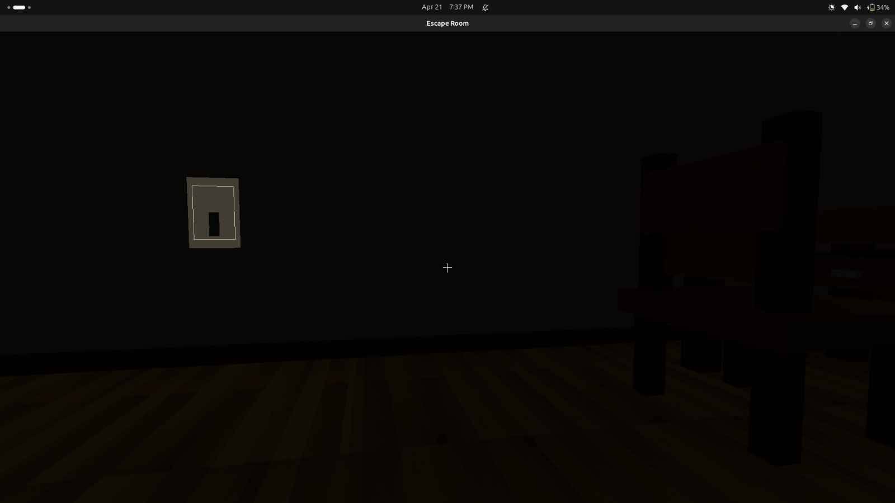
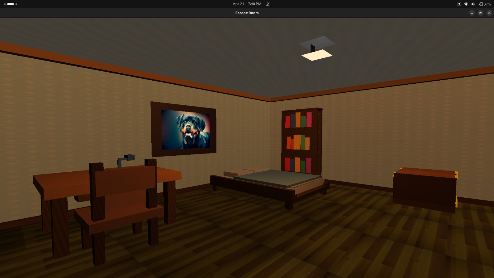
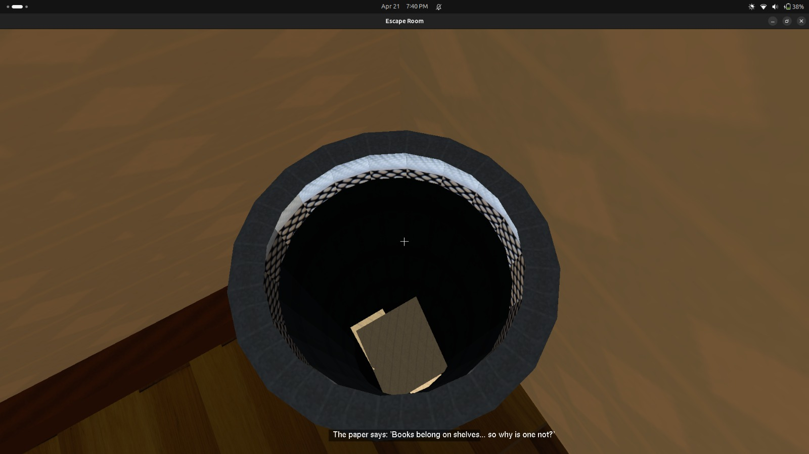
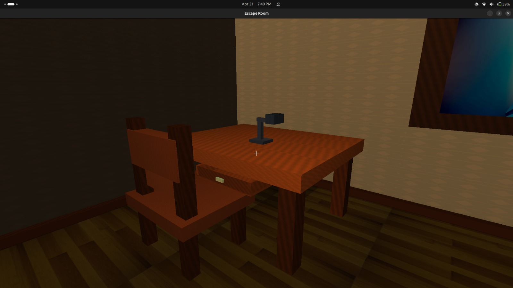
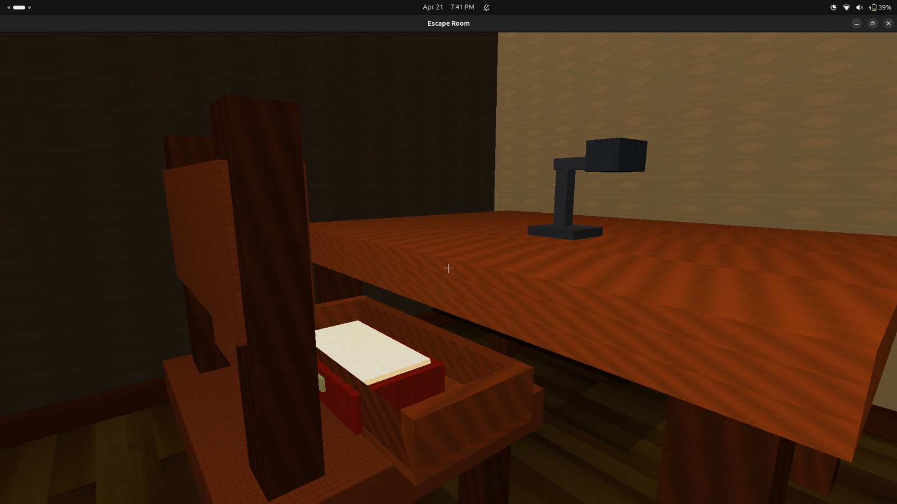
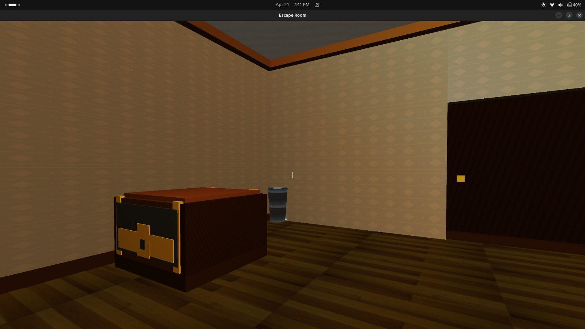
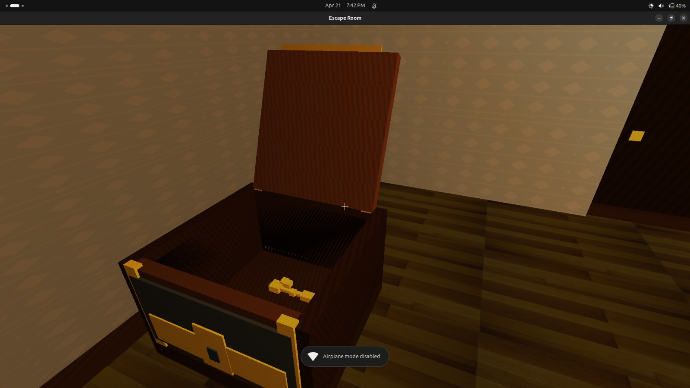
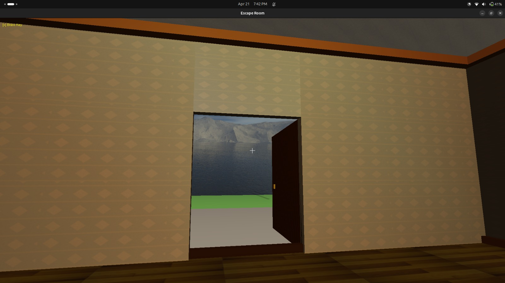
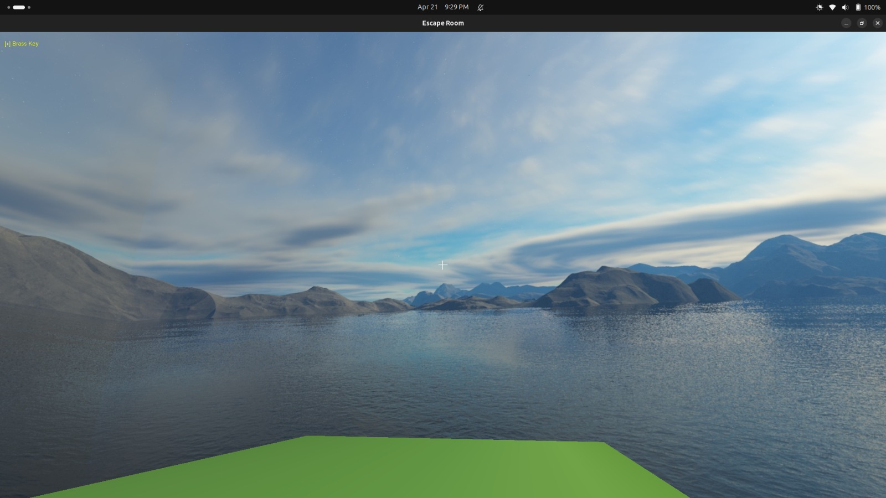
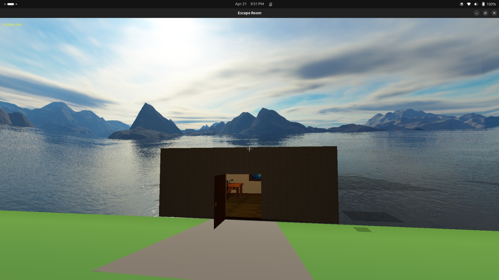

#  Escape Room Game

## Overview
This project is an interactive **Escape Room game** implemented using C++,OpenGL. The player is placed inside a room and must explore, observe clues, and solve a sequence of puzzles to escape.

The gameplay is centered around **environmental storytelling and clue-based interactions**, where several objects in the room contributes to solving the final puzzle.

---

## Requirements

Before running the project, ensure you have:

- C++ compiler (g++ / clang++)
- OpenGL (if graphics-based rendering is used)
- GLFW / GLUT (depending on your implementation)
- Make / CMake (if build system is used)

---

## How to Install OpenGL(Ensure you have Linux system)

Run this command in your terminal
```bash
sudo apt-get install freeglut3-dev libglu1-mesa-dev libgl1-mesa-dev
```

---

## How to Run the Project

### 1. Clone the Repository
```bash
git clone <your-repo-link>
cd Escape-Room
```

### 2. Build the Project

#### If using Make:
```bash
make
```

#### If using CMake:
```bash
mkdir build
cd build
cmake ..
make
```

### 3. Run the Game
```bash
./escape_room
```

---

## Controls

- **W / A / S / D** → Move around  
- **Mouse** → Look around  
- **E / Enter** → Interact with objects  
- **ESC** → Exit game  
- **C** → Move up
- **Spacebar** → Move down
---

## Gameplay / Game Flow

The main gameplay loop is a **clue-based puzzle sequence**.

### Initialization
All interactive objects are initialized in:
```
room/room.cpp
```

The room contains the following important elements:
- Door  
- Highlighted Book  
- Dustbin Paper  
- Light Switch  
- Desk Drawer  
- Drawer Book  
- Code Box (Chest)  
- Brass Key  

These are stored inside the `worldItems` structure.

---

### Puzzle Flow

1. **Dustbin Clue**  
   - A paper in the dustbin hints that a book is out of place.

2. **Observation**  
   - The highlighted book on the desk draws attention.

3. **Hidden Hint**  
   - Opening the drawer reveals a book with emphasized letters:  
     ```
     K, E, Y
     ```

4. **Code Entry**  
   - The player interacts with the chest (code box interface).  
   - The correct 3-letter code must be entered.

5. **Unlocking the Chest**  
   - Entering:
     ```
     KEY
     ```
     unlocks the chest.

6. **Reward**  
   - The chest opens and reveals a **brass key**.

7. **Escape**  
   - Collecting the key allows the player to open the door and escape.

---

## Implementation Details

### Code Entry Logic
- File: `utils/interactions.cpp`  
- Function: `handleCodeBoxKeypress()`

---

### Chest Animation
- File: `room/room_codebox.cpp`  
- Uses:
  - `codeBoxOpenProgress`
  - Converted into lid rotation using easing

---

### Door Mechanics
- Logic handled in: `utils/interactions.cpp`  
- Rendering handled in: `room/room.cpp`

---

## Features

- Interactive object system  
- Clue-based puzzle design  
- Smooth animations (chest opening)  
- Progressive gameplay flow  
- Real-time interaction handling  


## Images
 1.After entering the room ,before Switching on the Light.



 2.After Switching on the Light.

 

 3.A paper in the dustbin which holds a clue .

 

 4.Table before opening the drawer.
 


 5.Table after opening the drawer and the drawer holds a book.

 

 6.The box which holds the key and asks the secret code to reveal the key.

 

 7.After the box is opened , the key is visible and can be collected and can be used to open the door .
 
 

 8.Door opens after we use the Brass key we previously collected.

 

 9.Outside view after escaping from the room.

 

 10.Escape Room view from outside in open environment.
 
 
